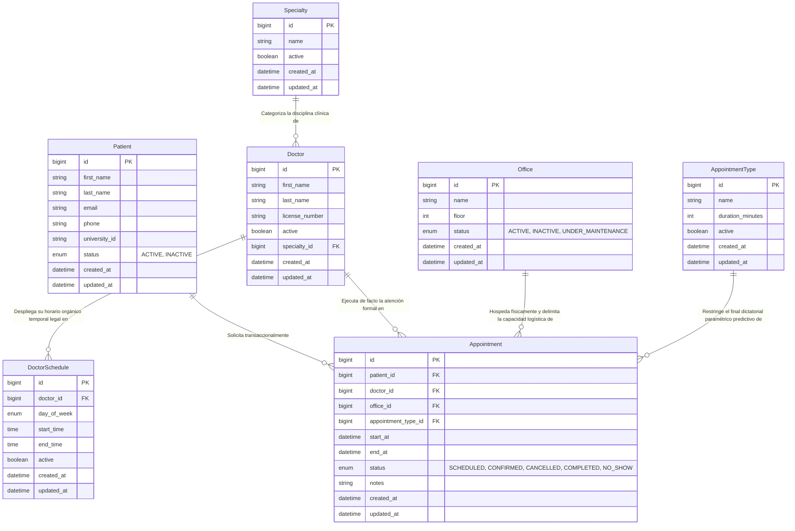

# Modelo Entidad-Relación (MER): Sistema de Citas Médicas Universitarias

Este documento especifica la arquitectura de datos relacional y el diseño estructural que sustentan el backend de gestión transaccional de la clínica universitaria. El modelo describe formalmente las 7 entidades de dominio persistidas en la capa de base de datos PostgreSQL, las cuales rigen la lógica relacional instrumentada mediante JPA e Hibernate.

---

## 1. Justificación Estructural de la Entidad Transaccional Central: `Appointment`

La concepción algorítmica del sistema ubica de manera inequívoca a `Appointment` (Cita Médica) como la estructura "Pivote" y entidad central. Para que un servicio u operación médica logre consolidarse exitosamente en tiempo y forma, converge simultáneamente y sin excepción una intersección forzada de cuatro dominios maestros sobre un marco temporal hermético. Estos cuatro dominios referenciados por llave foránea corresponden a:

1. El sujeto orgánico beneficiario: **Paciente (`Patient`)**.
2. El especialista prestatario asignado: **Médico (`Doctor`)**.
3. El activo de la locación física aprovisionado: **Consultorio (`Office`)**.
4. La naturaleza de estandarización protocolaria del marco temporal de servicio: **Tipo de Cita (`AppointmentType`)**.

De este modo integrativo, la entidad `Appointment` rige dictámenes profundos en el software: es baluarte esencial en las inferencias matemáticas del algoritmo anti-overbooking (overlap temporal regido por `start_at` y `end_at`), hospeda inmutabilidad sobre toda la semántica de la máquina de transiciones de estados (Status Machine), y se comporta centralizadamente como agrupador atómico en el procesamiento táctico subyacente a los reportes o tableros de analítica avanzada.

---

## 2. Diccionario de Datos y Especificación Formal de Entidades

A continuación se explicita la semántica lógica profunda impuesta para cada tabla transaccional subyacente.
*Nota Genérica Arquitectónica: Para el estricto cumplimiento de estándares organizacionales, todas las entidades presentadas a continuación surgen por herencia subyacente a nivel códice de mapeo del patrón `BaseEntity`, garantizando estructuralmente la autogeneración e inyección por defecto de `id` (BigInteger PK Identificador Auto-Gestionado), así como los artefactos forenses inalterables de auditoría `created_at` (Timestamp) y `updated_at` (Timestamp).*

### 🏥 1. `Patient` (Paciente)
Acapara la data sociodemográfica de aquellos individuos vinculados (alumnado, nómina personal) que figuran como solicitantes o receptores del servicio.
- **Atributos Principales Registrados:**
  - `first_name` (String, len 100) - Nombre nominal.
  - `last_name` (String, len 100) - Identificador apical o apellido.
  - `email` (String, len 150, Unique) - Enlace de correspondencia estricto formal biunívoco.
  - `phone` (String, len 20) - Canal telefónico con el individuo.
  - `university_id` (String, len 50, Unique) - Matriculación inalterable. Base para conciliación administrativa en sede universitaria de pertenencia.
  - `status` (Enum: `ACTIVE`, `INACTIVE`) - Accesibilidad burocrática del expediente.
- **Multiplicidad Directa:** Dispone de obligatoriedad `1 : Muchísimas (N)` frente a resoluciones en `Appointment`.

### 👨‍⚕️ 2. `Doctor` (Médico / Especialista)
Expediente del conjunto de personal licenciado operativamente contratado para dictaminar o surtir atenciones.
- **Atributos Principales Registrados:**
  - `first_name` (String, len 100) - Nombre representativo de pila profesional.
  - `last_name` (String, len 100) - Apellidos representativos.
  - `license_number` (String, len 50, Unique) - Licencia legal inamovible / Id de Colegiatura avalando integridad.
  - `active` (Boolean) - Bandera prescriptiva de habilitación u obsolescencia contractual temporal/definitiva del médico.
  - `specialty_id` (FK) - Restricción impuesta en llave foránea enlazando al área específica de dominio aludido.
- **Multiplicidad Directa:** Enraíza bajo un patrón ramificado dual `1 : Muchísimas (N)` de cara a `Appointment` y `DoctorSchedule`, y bajo una tutela subordinada originaria `Muchas (N) : 1` con respecto al supra-rango de dependencia en `Specialty`.

### 🔬 3. `Specialty` (Especialidad Médica)
Catálogo tipificatorio que delimita las escuelas o saberes especializados regentes dentro del predio clínico (Ej. Cardiología, Médico Alternativo, Odontología base).
- **Atributos Principales Registrados:**
  - `name` (String, len 100, Unique) - Rotulación y denominación explícitas de la maestría.
  - `active` (Boolean) - Determinación normativa encendiendo o congelando la visibilidad del servicio para atenciones y contrataciones prospectivas.
- **Multiplicidad Directa:** Gobierna verticalmente una jerarquía de `1 : Muchísimos (N)` para el personal humano registrado en `Doctor`.

### 🏢 4. `Office` (Consultorio / Sede / Activo Físico)
Abarca persistentemente a los inmuebles y aulas físicas que albergan perimetralmente e instrumentan las consultas de manera funcional.
- **Atributos Principales Registrados:**
  - `name` (String, len 50) - Nomenclatura del bloque físico (Ej. "Torre Norte Cons. B").
  - `floor` (Integer) - Pertenencia de la planta o altura física de la superficie del activo para guía perimetral.
  - `status` (Enum: `ACTIVE`, `INACTIVE`, `UNDER_MAINTENANCE`) - Delimitador estricto condicionando si el consultorio cuenta con las garantías habitables transitorias para asignación o si recae en bloque de mantenimiento técnico.
- **Multiplicidad Directa:** Resuelve hospedando locaciones intersecándolas por una distribución `1 : Varias (N)` a `Appointment`.

### 📑 5. `AppointmentType` (Tipo de Cita Paramétrica)
Taxonomía administrativa procedimental para encapsular dictámenes orgánicos sobre temporalidad. El mandato capital de este constructo es absolver lógicamente la extrapolación del lapso normativo de atención, desincorporando de errores semánticos manuales los rangos temporales o el final predecible de los servicios clínicos.
- **Atributos Principales Registrados:**
  - `name` (String, len 100, Unique) - Descriptor referencial (Ej. "Evaluación Completa Anual").
  - `duration_minutes` (Integer) - Elemento base algorítmico matemático; cifra referencial proyectiva predeterminante para pre-popular de forma inequívoca el final (`end_at`) temporal de todo empalme.
  - `active` (Boolean) - Señalética global autorizando y ratificando prospectivas programaciones a utilizar dicha denominación predeterminada.
- **Multiplicidad Directa:** Despeja un rango paramétrico de `1 : Múltiples (N)` encasillado en `Appointment`.

### 🕒 6. `DoctorSchedule` (Esquema y Franja Predeterminada Laboral)
Cifra referencial recurrente presencial donde cada doctrinario expende sus tramos orgánicos dictatorialmente dispuestos en una línea de turno ininterrumpido. Este parámetro sirve al sistema de base subyacente al motor algorítmico interrogador transversal (`/api/availability`) cruzando las matrices para perfilar legalmente huecos válidos u open spots ofertables para los frontales web interactivos.
- **Atributos Principales Registrados:**
  - `doctor_id` (FK) - Patrocinador e incardinante legal responsable de las aberturas laborales.
  - `day_of_week` (Enum: `MONDAY`, `TUESDAY`, ..., `SUNDAY`) - Constante formal delineando el día recurrente en calendarización global.
  - `start_time` (Time / LocalTime) - Hora puntual infernal marcatoria de entrada nominal autorizada legalmente.
  - `end_time` (Time / LocalTime) - Hora de salida en cierre nominal en la caducidad operativa en frontera diaria.
  - `active` (Boolean) - Pre-disposicional encendedor de anulación o desobstrucción preestablecida a futuro del turno laboral.
- **Multiplicidad Directa:** Recae subsumida ante el sujeto contractual por derivación `Varias (N) : 1` frente a su responsable global único `Doctor`.

### 📅 7. `Appointment` (Cita Clínica Transaccional)
Arquetípico nódulo orquestador transaccional en estado puro operado desde base.
- **Atributos Principales Registrados:**
  - Cuatríada estructural foránea restrictiva para control obligacional formal en `patient_id` (FK), `doctor_id` (FK), `office_id` (FK) y `appointment_type_id` (FK).
  - `start_at` (DateTime / LocalDateTime) - Bloque y matriz de anclaje inicial acordado.
  - `end_at` (DateTime / LocalDateTime) - Campo autoestablecido sistemáticamente en pro de proyecciones analíticas en prevención de "collision check" sobre la misma tabla y perfiles subyacentes.
  - `status` (Enum: `SCHEDULED`, `CONFIRMED`, `CANCELLED`, `COMPLETED`, `NO_SHOW`) - Cadena trazable y auditable acarreando el peso histórico del avance de procesos logísticos (Máquina Férrea de Estados).
  - `notes` (String, len aprox 500) - Observaciones operacionales. Recopilatorio forense somero para anexar eventualidades justificatorias en cancelaciones bruscas por parte de los clientes internos o anotaciones directrices médicas de descargo terminal post-evaluativo.
- **Multiplicidad Directa:** Entidad concentradora pasiva que actúa como un receso dependiente general de `Gran Variedad (N) : 1` frente a cuatro polos independientes regidores (Patient, Doctor, Office, y AppointmentType).

---

## 3. Diagrama Entidad-Relación Dinámico (Mermaid)

El siguiente gráfico técnico detalla el comportamiento estructural unívoco de los dominios base al interior del acoplamiento JPA/Hibernate y las restricciones formales foráneas generadas sistémicamente de cada llave interconectada.

