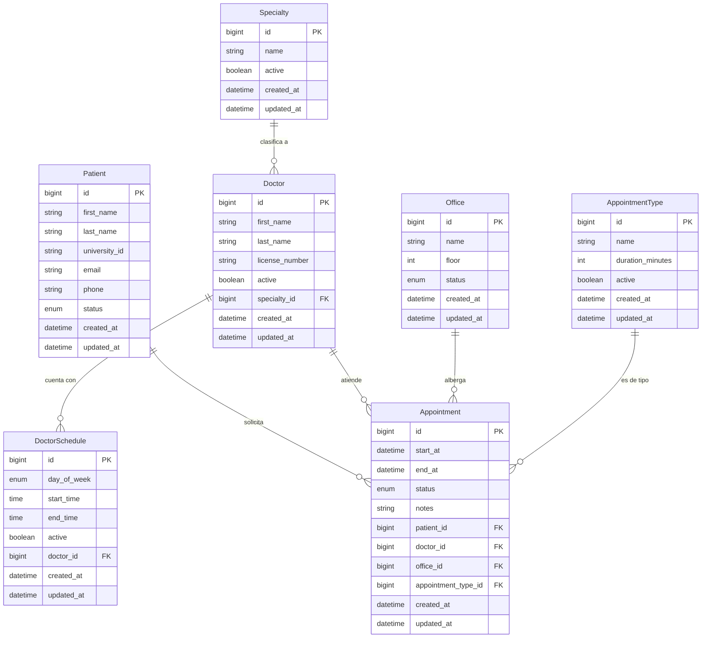

# Bundle 00_root_and_docs

Proyecto: `clinic-reservations`
Grupo: `00_root_and_docs`
### Archivo: `MER.md`
- Bytes: 5100
- Encoding detectado: utf-8

```md
# Modelo Entidad-Relación (MER): Sistema de Citas Médicas

Este documento contiene la representación y diccionario de datos base para las entidades implicadas en el backend del sistema de reservaciones de la clínica universitaria.

## Resumen de Entidades Principales y Descripción

1. **Patient (Paciente)**: Almacena los perfiles demográficos de los clientes o asistentes a la clínica.
2. **Doctor**: Agrupa a los especialistas disponibles adscritos al centro.
3. **Specialty (Especialidad)**: Catálogo base centralizado de las ramas de la medicina disponibles para cita.
4. **Office (Consultorio)**: Espacios destinados a prestar el servicio físico.
5. **AppointmentType (Tipo de Cita)**: Clasifica las citas según el contexto clínico, definiendo el tiempo estándar por defecto a reservar.
6. **DoctorSchedule (Horario Medico)**: Las franjas de disponibilidad en la semana del médico para automatizar confirmaciones de agenda.
7. **Appointment (Cita)**: La tabla transaccional fundamental que cruza entidades registrando el momento en el que convergen Pacientes, Doctores y Consultorios bajo un tipo de Cita.

---

## Atributos Principales, Relaciones y Cardinalidad

### 🏥 Entidad: Patient
- **Atributos:** `id` (PK), `first_name`, `last_name`, `university_id`, `email`, `phone`, `status` (enum: ACTIVE, INACTIVE), `created_at`, `updated_at`
- **Relaciones:** Puede tener MUCHAS Citas (`1 a N`).

### 👨‍⚕️ Entidad: Doctor
- **Atributos:** `id` (PK), `first_name`, `last_name`, `license_number`, `specialty_id` (FK), `active` (boolean), `created_at`, `updated_at`
- **Relaciones:**
    - Pertenece a UNA Especialidad (`N a 1`).
    - Posee MUCHOS Horarios configurados (`1 a N`).
    - Es asignado a MUCHAS Citas (`1 a N`).

### 🔬 Entidad: Specialty
- **Atributos:** `id` (PK), `name`, `active` (boolean), `created_at`, `updated_at`
- **Relaciones:** Puede clasificar a MUCHOS Doctores (`1 a N`).

### 🏢 Entidad: Office
- **Atributos:** `id` (PK), `name`, `floor` (integer), `status` (enum: ACTIVE, INACTIVE, UNDER_MAINTENANCE), `created_at`, `updated_at`
- **Relaciones:** Una oficina puede albergar MUCHAS citas (en diferentes horarios) (`1 a N`).

### 📑 Entidad: AppointmentType
- **Atributos:** `id` (PK), `name`, `duration_minutes` (integer), `active` (boolean), `created_at`, `updated_at`
- **Relaciones:** Aplica a MUCHAS Citas (`1 a N`).

### 🕒 Entidad: DoctorSchedule
- **Atributos:** `id` (PK), `doctor_id` (FK), `day_of_week` (enum: MONDAY–SUNDAY), `start_time` (time), `end_time` (time), `active` (boolean), `created_at`, `updated_at`
- **Relaciones:** Pertenece exclusivamente a UN doctor base.

### 📅 Entidad: Appointment
- **Atributos:** `id` (PK), `patient_id` (FK), `doctor_id` (FK), `office_id` (FK), `appointment_type_id` (FK), `start_at` (datetime), `end_at` (datetime), `status` (enum: SCHEDULED, CONFIRMED, CANCELLED, COMPLETED, NO_SHOW), `notes`, `created_at`, `updated_at`
- **Relaciones:** Es la tabla pivote principal. Se asocia mediante FK con UN paciente, UN doctor, UN consultorio y UN tipo de cita (`4 dependencias fuertes 1 a 1 transaccionalmente`).

---

## Representación Mermaid (ER Diagram)

Dicho modelo visual puede ser exportado e importado de manera nativa en herramientas como *Draw.io*:



```

---

### Archivo: `README.md`
- Bytes: 5275
- Encoding detectado: utf-8

```md
# Sistema de Gestión de Citas Médicas - Taller Universitario

## 1. Descripción General del Sistema
Este es un sistema robusto para la reserva, gestión y administración de citas médicas diseñado para entornos universitarios y clínicos, permitiendo el control del ciclo de vida completo de atenciones.
El sistema administra médicos, sus especialidades y horarios, así como a pacientes, consultorios, tipos de cita y los registros operativos para la toma de decisiones clínicas mediante reportes de uso y desempeño.

## 2. Stack Tecnológico
El proyecto hace uso intensivo de tecnologías modernas de backend alineado con estándares académicos e industriales actuales:
- **Java 21**
- **Spring Boot 4**
- **PostgreSQL**
- **Testcontainers**
- **JUnit 5**
- **Mockito**
- **Maven**

## 3. Arquitectura por Capas
El proyecto implementa una arquitectura multicapa (N-Tier) convencional limpia con Spring Boot:
- **Capa Entidad / Dominio**: Objetos mapeados a la base de datos a través de JPA/Hibernate (Entities).
- **Capa Repositorio (Data Access)**: Subinterfaces `JpaRepository` delegando las interacciones a la base de datos.
- **Capa de Servicio (Lógica de Negocio)**: Implementación de contratos (Interfaces) y clases concretas de servicio donde residen las validaciones de negocio, previniendo acoplamiento.
- **Capa Controlador (Presentación/API)**: Clases con `@RestController` que manejan todas las solicitudes HTTP, el parseo del payload y las devoluciones del API estructuradas.

## 4. Modelo de Datos Resumido
El sistema se compone de entidades transaccionales centrales interrelacionadas:
- **Patient**: Manejo de historial y datos del usuario del servicio.
- **Doctor & Specialty**: Personal médico adscrito a una especialidad.
- **DoctorSchedule**: Disponibilidad del médico a lo largo de la semana.
- **Office**: Espacio físico destinado a la labor médica.
- **AppointmentType**: Definición paramétrica de los tipos de servicio/procedimiento y sus duraciones.
- **Appointment**: La tabla pivote/transaccional más importante. Conecta todas las restricciones temporales.

Para más detalle a nivel de diagramas e integridad referencial, consulta [MER.md](./MER.md).

## 5. Reglas de Negocio Principales
- Un doctor está asociado obligatoriamente a una especialidad.
- Un doctor necesita horarios parametrizados (`DoctorSchedule`) para estar disponible para tomar citas.
- Las citas (`Appointment`) vinculan inherentemente al paciente, doctor, consultorio y duración según tipo de consulta (`AppointmentType`).
- Al crear una cita, el sistema valida que el rango horario caiga dentro de un `DoctorSchedule` activo del doctor para ese día de la semana.
- Un consultorio (`Office`) solo puede estar en uso en una cita a la vez, garantizando nulas colisiones.
- El ciclo de vida de la Cita de forma general: `SCHEDULED` -> `CONFIRMED` -> `COMPLETED` / `CANCELLED` / `NO_SHOW`.

## 6. Base de Datos: Cómo levantar PostgreSQL con Docker
Para habilitar el servicio de datos usando Docker, corre el siguiente comando (puedes detener y remover uno existente primero de ser necesario):

Si cuentas con un archivo `docker-compose.yml` en la raíz del proyecto, puedes levantar el servicio ejecutando:

```bash
docker compose up -d
```

Alternativamente, puedes correr un contenedor directamente:

```bash
docker run --name pg-clinic -e POSTGRES_DB=consultorios_db -e POSTGRES_USER=consultorios_user -e POSTGRES_PASSWORD=secret123 -p 5432:5432 -d postgres
```

## 7. Cómo correr la aplicación
Antes de levantar el servidor, asegúrate de que el contenedor de Docker esté ejecutándose correctamente.
Para ejecutar la aplicación y compilar todo en Spring Boot:

```bash
mvn spring-boot:run
```
*(El servidor comenzará de manera habitual en el puerto 8080)*

## 8. Cómo ejecutar Pruebas Automáticas y Validación
Para verificar la estabilidad y ejecutar toda la suite de pruebas unitarias e integrales del proyecto apoyado en Testcontainers, ejecuta:

```bash
mvn clean test
```

## 9. Endpoints Principales
A continuación, algunos de los endpoints base habilitados. Consulta el fichero [requests.http](./requests.http) para la colección extendida.
- **Pacientes:** `/api/patients` (GET, POST, PUT)
- **Doctores:** `/api/doctors` (GET, POST, PUT)
- **Citas:** `/api/appointments` (GET, POST)
- **Citas [Estados]:** `/api/appointments/{id}/{confirm|cancel|complete|no-show}` (PUT)
- **Reportes:** `/api/reports/...` (GET)

## 10. Decisiones de Diseño Principal
- **Inyección de Dependencias (DI):** Inyección de dependencias en constructores utilizando `@RequiredArgsConstructor`.
- **Uso Estricto de DTOs:** Se hace uso extensivo y explícito de Data Transfer Objects (`Request` / `Response`) para transferir información en las peticiones y respuestas HTTP. Esto blinda las entidades de la base de datos y permite exponer solo los atributos necesarios por la API, manteniendo la seguridad e integridad.
- **Separación de Responsabilidades:** Lógica encapsulada netamente en los `Services`.

## 11. Limitaciones Relativas
- No incluye un módulo robusto de autenticación en su estado actual (por ej. Spring Security + JWT).
- No soporta concurrencia masiva ni eventos re-creacionales de auditoría completa, asume flujos controlados.

```

---

### Archivo: `auditoria_endpoints.txt`
- Bytes: 9926
- Encoding detectado: latin-1

```txt
ÿþ

src\main\java\com\university\clinic\controller\AppointmentController.java:34:@RequestMapping("/api/appointments")

src\main\java\com\university\clinic\controller\AppointmentController.java:42:    @GetMapping

src\main\java\com\university\clinic\controller\AppointmentController.java:47:    @GetMapping("/{id}")

src\main\java\com\university\clinic\controller\AppointmentController.java:53:    @GetMapping(params = "doctorId")

src\main\java\com\university\clinic\controller\AppointmentController.java:59:    @GetMapping(params = "patientId")

src\main\java\com\university\clinic\controller\AppointmentController.java:65:    @GetMapping(params = "status")

src\main\java\com\university\clinic\controller\AppointmentController.java:71:    @GetMapping(params = {"from", "to"})

src\main\java\com\university\clinic\controller\AppointmentController.java:80:    @PostMapping

src\main\java\com\university\clinic\controller\AppointmentController.java:88:    @PutMapping("/{id}/confirm")

src\main\java\com\university\clinic\controller\AppointmentController.java:94:    @PutMapping("/{id}/cancel")

src\main\java\com\university\clinic\controller\AppointmentController.java:100:    @PutMapping("/{id}/complete")

src\main\java\com\university\clinic\controller\AppointmentController.java:106:    @PutMapping("/{id}/no-show")

src\main\java\com\university\clinic\controller\AppointmentTypeController.java:15:@RequestMapping("/api/appointment-type

s")

src\main\java\com\university\clinic\controller\AppointmentTypeController.java:21:    @GetMapping

src\main\java\com\university\clinic\controller\AppointmentTypeController.java:26:    @GetMapping("/{id}")

src\main\java\com\university\clinic\controller\AppointmentTypeController.java:31:    @PostMapping

src\main\java\com\university\clinic\controller\AppointmentTypeController.java:36:    @PutMapping("/{id}")

src\main\java\com\university\clinic\controller\AvailabilityController.java:22:@RequestMapping("/api/availability")

src\main\java\com\university\clinic\controller\AvailabilityController.java:28:    @GetMapping("/doctors/{doctorId}")

src\main\java\com\university\clinic\controller\DoctorController.java:16:@RequestMapping("/api/doctors")

src\main\java\com\university\clinic\controller\DoctorController.java:22:    @GetMapping

src\main\java\com\university\clinic\controller\DoctorController.java:27:    @GetMapping("/{id}")

src\main\java\com\university\clinic\controller\DoctorController.java:32:    @PostMapping

src\main\java\com\university\clinic\controller\DoctorController.java:37:    @PutMapping("/{id}")

src\main\java\com\university\clinic\controller\DoctorScheduleController.java:15:@RequestMapping("/api/doctors/{doctorId

}/schedules")

src\main\java\com\university\clinic\controller\DoctorScheduleController.java:21:    @GetMapping

src\main\java\com\university\clinic\controller\DoctorScheduleController.java:26:    @PostMapping

src\main\java\com\university\clinic\controller\OfficeController.java:16:@RequestMapping("/api/offices")

src\main\java\com\university\clinic\controller\OfficeController.java:22:    @GetMapping

src\main\java\com\university\clinic\controller\OfficeController.java:27:    @GetMapping("/{id}")

src\main\java\com\university\clinic\controller\OfficeController.java:32:    @PostMapping

src\main\java\com\university\clinic\controller\OfficeController.java:37:    @PutMapping("/{id}")

src\main\java\com\university\clinic\controller\PatientController.java:16:@RequestMapping("/api/patients")

src\main\java\com\university\clinic\controller\PatientController.java:22:    @GetMapping

src\main\java\com\university\clinic\controller\PatientController.java:27:    @GetMapping("/{id}")

src\main\java\com\university\clinic\controller\PatientController.java:32:    @PostMapping

src\main\java\com\university\clinic\controller\PatientController.java:37:    @PutMapping("/{id}")

src\main\java\com\university\clinic\controller\ReportController.java:27:@RequestMapping("/api/reports")

src\main\java\com\university\clinic\controller\ReportController.java:33:    @GetMapping("/office-occupancy")

src\main\java\com\university\clinic\controller\ReportController.java:40:    @GetMapping("/doctor-productivity")

src\main\java\com\university\clinic\controller\ReportController.java:47:    @GetMapping("/no-show-patients")

src\main\java\com\university\clinic\controller\SpecialtyController.java:21: * @RequestMapping = prefijo de ruta, como 

Route::prefix('api/specialties').

src\main\java\com\university\clinic\controller\SpecialtyController.java:24:@RequestMapping("/api/specialties")

src\main\java\com\university\clinic\controller\SpecialtyController.java:31:    @GetMapping

src\main\java\com\university\clinic\controller\SpecialtyController.java:37:    @GetMapping("/{id}")

src\main\java\com\university\clinic\controller\SpecialtyController.java:47:    @PostMapping

src\main\java\com\university\clinic\controller\SpecialtyController.java:53:    @PutMapping("/{id}")






```

---

### Archivo: `auditoria_estructura_main.txt`
- Bytes: 3316
- Encoding detectado: utf-8

```txt
Listado de rutas de carpetas
El número de serie del volumen es 465D-EBB9
C:\USERS\HP\DOCUMENTS\PROYECTO WEB\CLINIC-RESERVATIONS\SRC\MAIN\JAVA\COM\UNIVERSITY\CLINIC
│   ClinicReservationsApplication.java
│   
├───controller
│       AppointmentController.java
│       AppointmentTypeController.java
│       AvailabilityController.java
│       DoctorController.java
│       DoctorScheduleController.java
│       OfficeController.java
│       PatientController.java
│       ReportController.java
│       SpecialtyController.java
│       
├───dto
│       AppointmentResponse.java
│       AppointmentTypeResponse.java
│       AvailabilitySlotResponse.java
│       CancelAppointmentRequest.java
│       CreateAppointmentRequest.java
│       CreateAppointmentTypeRequest.java
│       CreateDoctorRequest.java
│       CreateDoctorScheduleRequest.java
│       CreateOfficeRequest.java
│       CreatePatientRequest.java
│       CreateSpecialtyRequest.java
│       DoctorProductivityResponse.java
│       DoctorResponse.java
│       DoctorScheduleResponse.java
│       NoShowPatientResponse.java
│       OfficeOccupancyResponse.java
│       OfficeResponse.java
│       PatientResponse.java
│       ReportResponse.java
│       SpecialtyResponse.java
│       UpdateDoctorRequest.java
│       UpdateOfficeRequest.java
│       UpdatePatientRequest.java
│       
├───entity
│       Appointment.java
│       AppointmentStatus.java
│       AppointmentType.java
│       BaseEntity.java
│       Doctor.java
│       DoctorSchedule.java
│       Office.java
│       OfficeStatus.java
│       Patient.java
│       PatientStatus.java
│       Specialty.java
│       
├───exception
│       BusinessException.java
│       ConflictException.java
│       GlobalExceptionHandler.java
│       ResourceNotFoundException.java
│       ValidationException.java
│       
├───mapper
│       AppointmentMapper.java
│       AppointmentTypeMapper.java
│       DoctorMapper.java
│       DoctorScheduleMapper.java
│       OfficeMapper.java
│       PatientMapper.java
│       SpecialtyMapper.java
│       
├───repository
│       AppointmentRepository.java
│       AppointmentTypeRepository.java
│       DoctorRepository.java
│       DoctorScheduleRepository.java
│       OfficeRepository.java
│       PatientRepository.java
│       SpecialtyRepository.java
│       
└───service
    │   AppointmentService.java
    │   AppointmentTypeService.java
    │   AvailabilityService.java
    │   DoctorScheduleService.java
    │   DoctorService.java
    │   OfficeService.java
    │   PatientService.java
    │   ReportService.java
    │   SpecialtyService.java
    │   
    └───impl
            AppointmentServiceImpl.java
            AppointmentTypeServiceImpl.java
            AvailabilityServiceImpl.java
            DoctorScheduleServiceImpl.java
            DoctorServiceImpl.java
            OfficeServiceImpl.java
            PatientServiceImpl.java
            ReportServiceImpl.java
            SpecialtyServiceImpl.java
            

```

---

### Archivo: `auditoria_estructura_test.txt`
- Bytes: 867
- Encoding detectado: utf-8

```txt
Listado de rutas de carpetas
El número de serie del volumen es 465D-EBB9
C:\USERS\HP\DOCUMENTS\PROYECTO WEB\CLINIC-RESERVATIONS\SRC\TEST\JAVA\COM\UNIVERSITY\CLINIC
│   ClinicReservationsApplicationTest.java
│   
├───controller
│       AppointmentControllerTest.java
│       AvailabilityControllerTest.java
│       DoctorControllerTest.java
│       PatientControllerTest.java
│       
├───integration
│       AppointmentRepositoryIntegrationTest.java
│       DoctorRepositoryIntegrationTest.java
│       DoctorScheduleRepositoryIntegrationTest.java
│       OfficeRepositoryIntegrationTest.java
│       PatientRepositoryIntegrationTest.java
│       
└───service
        AppointmentServiceImplTest.java
        AvailabilityServiceImplTest.java
        DoctorScheduleServiceImplTest.java
        

```

---

### Archivo: `auditoria_tests_lista.txt`
- Bytes: 3558
- Encoding detectado: latin-1

```txt
ÿþC:\Users\HP\Documents\proyecto web\clinic-reservations\src\test\java\com\university\clinic\controller\AppointmentControllerTest.java

C:\Users\HP\Documents\proyecto web\clinic-reservations\src\test\java\com\university\clinic\controller\AvailabilityControllerTest.java

C:\Users\HP\Documents\proyecto web\clinic-reservations\src\test\java\com\university\clinic\controller\DoctorControllerTest.java

C:\Users\HP\Documents\proyecto web\clinic-reservations\src\test\java\com\university\clinic\controller\PatientControllerTest.java

C:\Users\HP\Documents\proyecto web\clinic-reservations\src\test\java\com\university\clinic\integration\AppointmentRepositoryIntegrationTest.java

C:\Users\HP\Documents\proyecto web\clinic-reservations\src\test\java\com\university\clinic\integration\DoctorRepositoryIntegrationTest.java

C:\Users\HP\Documents\proyecto web\clinic-reservations\src\test\java\com\university\clinic\integration\DoctorScheduleRepositoryIntegrationTest.java

C:\Users\HP\Documents\proyecto web\clinic-reservations\src\test\java\com\university\clinic\integration\OfficeRepositoryIntegrationTest.java

C:\Users\HP\Documents\proyecto web\clinic-reservations\src\test\java\com\university\clinic\integration\PatientRepositoryIntegrationTest.java

C:\Users\HP\Documents\proyecto web\clinic-reservations\src\test\java\com\university\clinic\service\AppointmentServiceImplTest.java

C:\Users\HP\Documents\proyecto web\clinic-reservations\src\test\java\com\university\clinic\service\AvailabilityServiceImplTest.java

C:\Users\HP\Documents\proyecto web\clinic-reservations\src\test\java\com\university\clinic\service\DoctorScheduleServiceImplTest.java

C:\Users\HP\Documents\proyecto web\clinic-reservations\src\test\java\com\university\clinic\ClinicReservationsApplicationTest.java


```

---

### Archivo: `pom.xml`
- Bytes: 3824
- Encoding detectado: utf-8

```xml
<?xml version="1.0" encoding="UTF-8"?>
<project xmlns="http://maven.apache.org/POM/4.0.0"
         xmlns:xsi="http://www.w3.org/2001/XMLSchema-instance"
         xsi:schemaLocation="http://maven.apache.org/POM/4.0.0 https://maven.apache.org/xsd/maven-4.0.0.xsd">
    <modelVersion>4.0.0</modelVersion>

    <!-- Parent: Spring Boot 4.0.5 (equivalente a "require laravel/framework" en composer.json) -->
    <parent>
        <groupId>org.springframework.boot</groupId>
        <artifactId>spring-boot-starter-parent</artifactId>
        <version>4.0.5</version>
        <relativePath/> <!-- buscar en repositorio Maven central -->
    </parent>

    <groupId>com.university.clinic</groupId>
    <artifactId>clinic-reservations</artifactId>
    <version>1.0-SNAPSHOT</version>
    <packaging>jar</packaging>
    <name>clinic-reservations</name>
    <description>API REST para reservas de consultorios médicos universitarios</description>

    <properties>
        <java.version>21</java.version>
    </properties>

    <dependencies>
        <!-- Web: equivalente a instalar routes + controllers en Laravel -->
        <dependency>
            <groupId>org.springframework.boot</groupId>
            <artifactId>spring-boot-starter-web</artifactId>
        </dependency>

        <!-- JPA/Hibernate: equivalente a Eloquent ORM -->
        <dependency>
            <groupId>org.springframework.boot</groupId>
            <artifactId>spring-boot-starter-data-jpa</artifactId>
        </dependency>

        <!-- Validación: equivalente a FormRequest en Laravel -->
        <dependency>
            <groupId>org.springframework.boot</groupId>
            <artifactId>spring-boot-starter-validation</artifactId>
        </dependency>

        <!-- Driver PostgreSQL: equivalente a "pdo_pgsql" en PHP -->
        <dependency>
            <groupId>org.postgresql</groupId>
            <artifactId>postgresql</artifactId>
            <scope>runtime</scope>
        </dependency>

        <!-- Lombok: genera getters/setters/constructores automáticamente -->
        <dependency>
            <groupId>org.projectlombok</groupId>
            <artifactId>lombok</artifactId>
            <optional>true</optional>
        </dependency>

        <!-- ========== TESTING ========== -->

        <!-- Spring Boot Test: incluye JUnit 5 + Mockito -->
        <dependency>
            <groupId>org.springframework.boot</groupId>
            <artifactId>spring-boot-starter-test</artifactId>
            <scope>test</scope>
        </dependency>

        <!-- Testcontainers: levanta PostgreSQL en Docker para tests de integración -->
        <dependency>
            <groupId>org.springframework.boot</groupId>
            <artifactId>spring-boot-testcontainers</artifactId>
            <scope>test</scope>
        </dependency>
        <dependency>
            <groupId>org.testcontainers</groupId>
            <artifactId>junit-jupiter</artifactId>
            <version>1.20.4</version>
            <scope>test</scope>
        </dependency>
        <dependency>
            <groupId>org.testcontainers</groupId>
            <artifactId>postgresql</artifactId>
            <version>1.20.4</version>
            <scope>test</scope>
        </dependency>
    </dependencies>

    <build>
        <plugins>
            <plugin>
                <groupId>org.springframework.boot</groupId>
                <artifactId>spring-boot-maven-plugin</artifactId>
                <configuration>
                    <excludes>
                        <exclude>
                            <groupId>org.projectlombok</groupId>
                            <artifactId>lombok</artifactId>
                        </exclude>
                    </excludes>
                </configuration>
            </plugin>
        </plugins>
    </build>
</project>

```

---

### Archivo: `requests.http`
- Bytes: 5279
- Encoding detectado: utf-8

```http
### ==============================================
### ESPECIALIDADES
### ==============================================

### Crear Especialidad
POST http://localhost:8080/api/specialties
Content-Type: application/json

{
    "name": "Cardiología"
}

### Obtener Especialidades
GET http://localhost:8080/api/specialties


### ==============================================
### DOCTORES
### ==============================================

### Crear Doctor
POST http://localhost:8080/api/doctors
Content-Type: application/json

{
    "firstName": "Carlos",
    "lastName": "Rodríguez",
    "licenseNumber": "X998877",
    "specialtyId": 1
}

### Obtener todos los Doctores
GET http://localhost:8080/api/doctors

### Obtener Doctor por ID
GET http://localhost:8080/api/doctors/1

### Actualizar Doctor
PUT http://localhost:8080/api/doctors/1
Content-Type: application/json

{
    "firstName": "Carlos Andrés",
    "lastName": "Rodríguez",
    "licenseNumber": "X998877",
    "specialtyId": 1
}


### ==============================================
### PACIENTES
### ==============================================

### Crear Paciente
POST http://localhost:8080/api/patients
Content-Type: application/json

{
    "firstName": "Ana",
    "lastName": "Gómez",
    "universityId": "11223344",
    "email": "ana.gomez@mail.com",
    "phone": "555-8765"
}

### Obtener todos los Pacientes
GET http://localhost:8080/api/patients

### Obtener Paciente por ID
GET http://localhost:8080/api/patients/1

### Actualizar Paciente
PUT http://localhost:8080/api/patients/1
Content-Type: application/json

{
    "firstName": "Ana Lucia",
    "lastName": "Gómez",
    "universityId": "11223344",
    "email": "ana.gomezl@mail.com",
    "phone": "555-9988"
}


### ==============================================
### CONSULTORIOS (OFFICES)
### ==============================================

### Crear Consultorio
POST http://localhost:8080/api/offices
Content-Type: application/json

{
    "name": "Consultorio 101",
    "floor": 1
}

### Obtener Consultorios
GET http://localhost:8080/api/offices

### Modificar Consultorio
PUT http://localhost:8080/api/offices/1
Content-Type: application/json

{
    "name": "Consultorio 101A",
    "floor": 1,
    "status": "ACTIVE"
}


### ==============================================
### TIPOS DE CITA
### ==============================================

### Crear Tipo de Cita
POST http://localhost:8080/api/appointment-types
Content-Type: application/json

{
    "name": "Chequeo General",
    "durationMinutes": 30
}

### Obtener Tipos de Cita
GET http://localhost:8080/api/appointment-types


### ==============================================
### HORARIOS DE DOCTOR (SCHEDULES)
### ==============================================

### Crear Horario para el Doctor (Doctor ID = 1)
POST http://localhost:8080/api/doctors/1/schedules
Content-Type: application/json

{
    "dayOfWeek": "MONDAY",
    "startTime": "08:00:00",
    "endTime": "14:00:00"
}

### Obtener Horarios de un Doctor
GET http://localhost:8080/api/doctors/1/schedules


### ==============================================
### DISPONIBILIDAD
### ==============================================

### Consultar Disponibilidad del Doctor (requiere date, durationMinutes es opcional, default 30)
GET http://localhost:8080/api/availability/doctors/1?date=2026-04-20&durationMinutes=30


### ==============================================
### CITAS (APPOINTMENTS)
### ==============================================

### Crear Cita
POST http://localhost:8080/api/appointments
Content-Type: application/json

{
    "patientId": 1,
    "doctorId": 1,
    "officeId": 1,
    "appointmentTypeId": 1,
    "startAt": "2026-04-20T09:00:00"
}

### Obtener Citas
GET http://localhost:8080/api/appointments

### Obtener Cita por ID
GET http://localhost:8080/api/appointments/1

### Filtrar citas por doctor
GET http://localhost:8080/api/appointments?doctorId=1

### Filtrar citas por paciente
GET http://localhost:8080/api/appointments?patientId=1

### Filtrar citas por estado
GET http://localhost:8080/api/appointments?status=SCHEDULED

### Filtrar citas por rango de fechas
GET http://localhost:8080/api/appointments?from=2026-04-01T00:00:00&to=2026-04-30T23:59:59

### Cambiar estado: Confirmar cita
PUT http://localhost:8080/api/appointments/1/confirm

### Cambiar estado: Completar cita
PUT http://localhost:8080/api/appointments/1/complete

### Cambiar estado: Paciente no asistió
PUT http://localhost:8080/api/appointments/1/no-show

### Cambiar estado: Cancelar cita (requiere body con reason)
PUT http://localhost:8080/api/appointments/1/cancel
Content-Type: application/json

{
    "reason": "El paciente solicita cancelar por motivos personales"
}


### ==============================================
### REPORTES
### ==============================================

### Reporte de Ocupación de Consultorios
GET http://localhost:8080/api/reports/office-occupancy?from=2026-04-01T00:00:00&to=2026-04-30T23:59:59

### Reporte de Productividad Médica
GET http://localhost:8080/api/reports/doctor-productivity?from=2026-04-01T00:00:00&to=2026-04-30T23:59:59

### Reporte de Pacientes Ausentes
GET http://localhost:8080/api/reports/no-show-patients?from=2026-04-01T00:00:00&to=2026-04-30T23:59:59

```